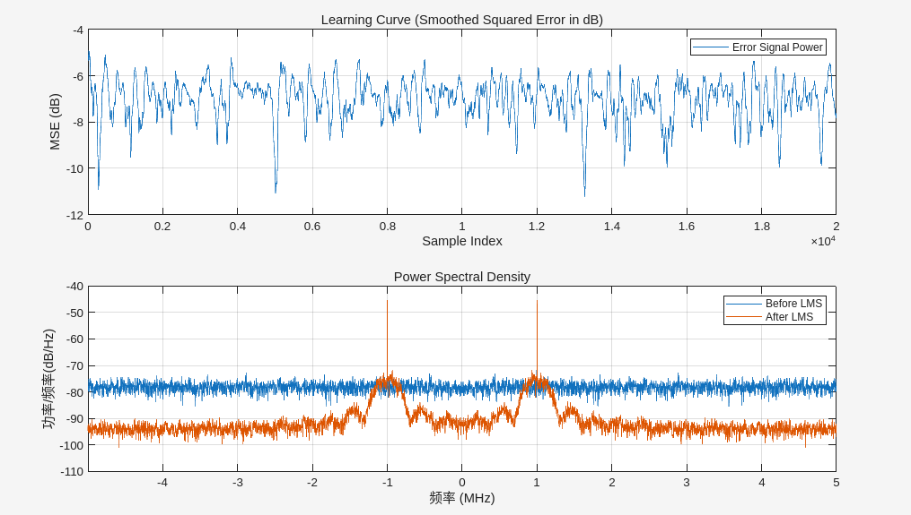
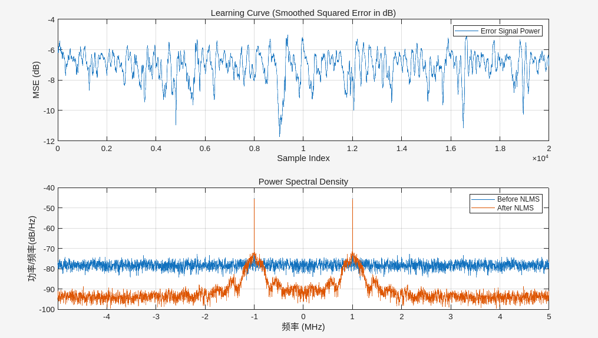
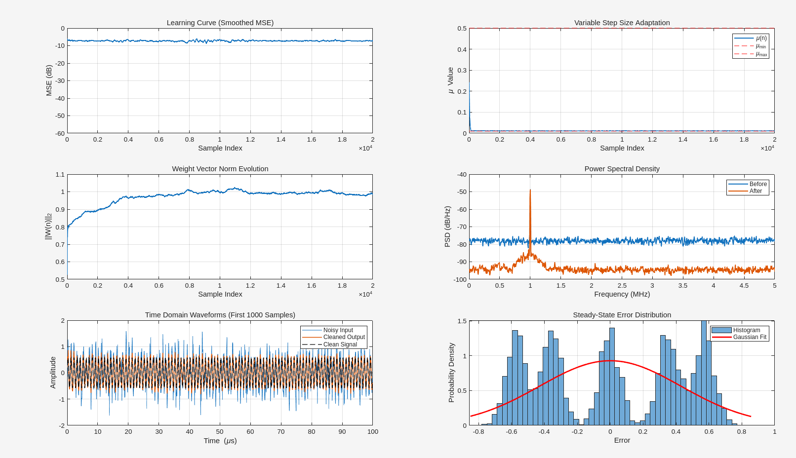

# lms vs nlms vs vss-nlms

## lms

    --- Running on ideal floating-point signals ---
    Normalized signal power: 0.1600
    Calculated step size (mu): 0.0391

    --- Performance Evaluation ---
    SNR Before: 0.51 dB
    SNR After:  8.68 dB
    SNR Improvement: 8.17 dB
    Theoretical Max Improvement: 17.01 dB

## nlms

    --- Running NLMS on ideal floating-point signals ---
    Using NLMS algorithm with mu = 0.20

    --- Performance Evaluation ---
    SNR Before: 0.51 dB
    SNR After:  8.25 dB
    SNR Improvement: 7.73 dB
    Theoretical Max Improvement: 17.01 dB

## vss-nlms

    
    SNR Before:       0.51 dB
    SNR After:        15.62 dB
    SNR Improvement:  15.10 dB
    Theoretical Max:  17.01 dB
    Efficiency:       88.8%
    Steady-state MSE: 1.85e-01
    Excess MSE:       1.81e-01
    ===================

    正在运行标准 NLMS 进行对比...
    SNR (Fixed NLMS): 10.94 dB
    VSS-NLMS Gain:    4.68 dB
